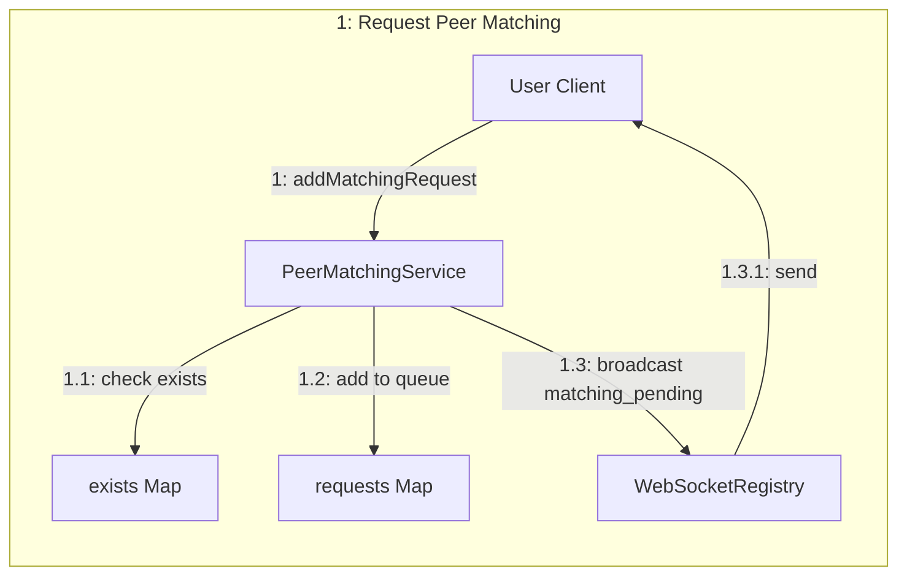
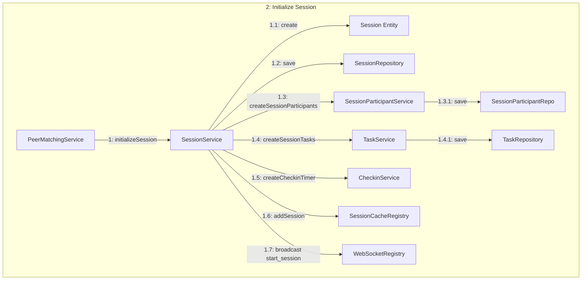
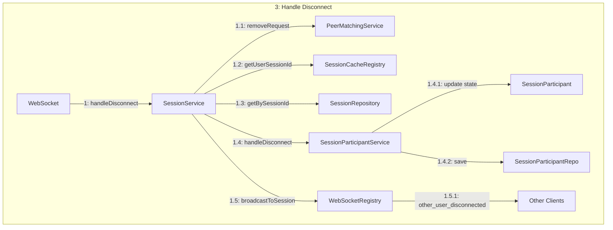
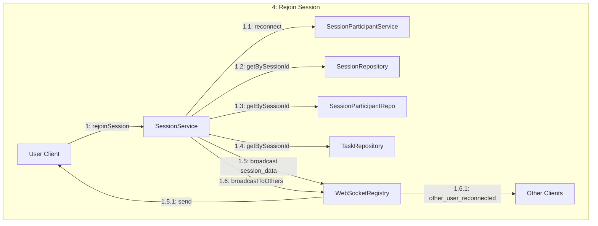
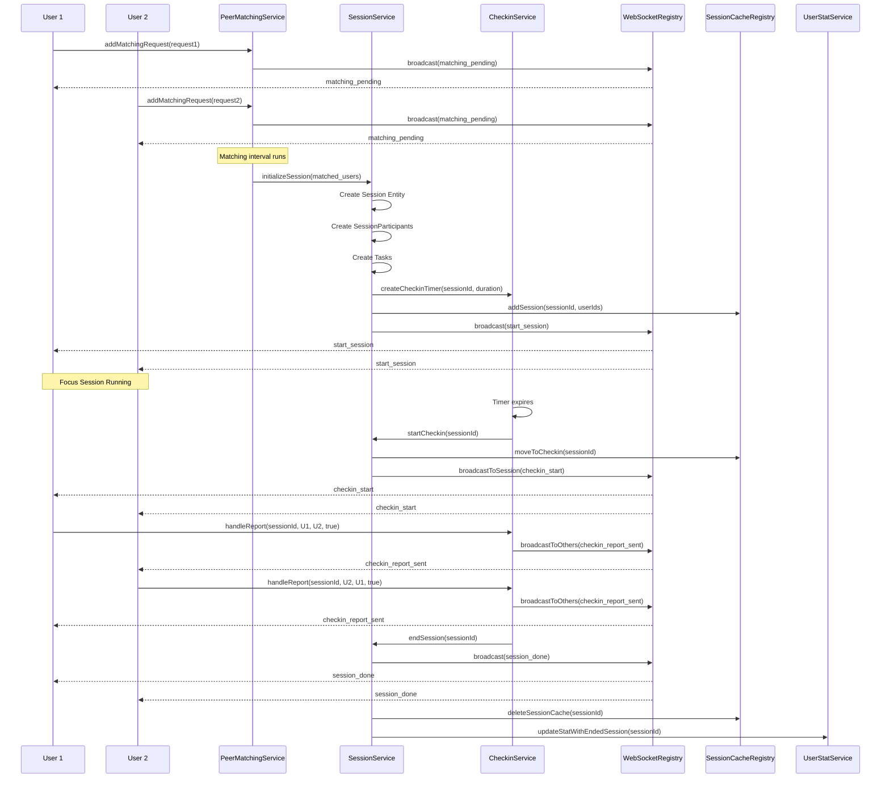
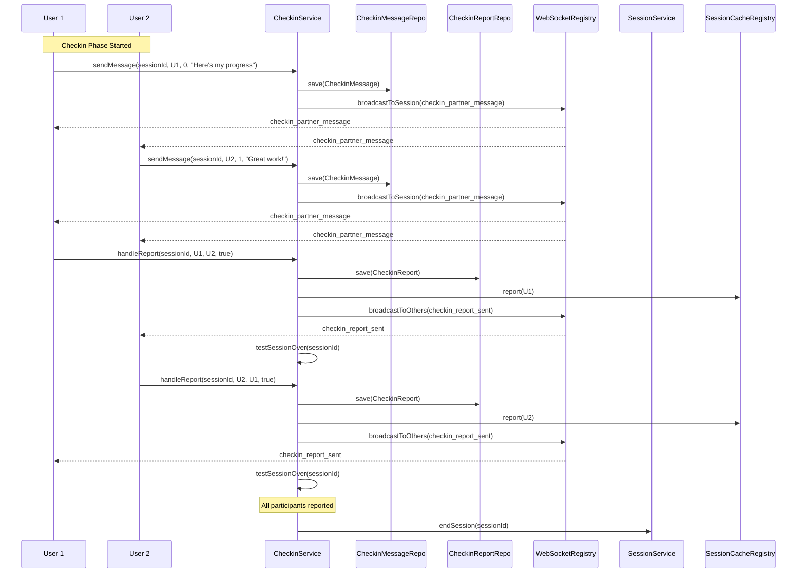
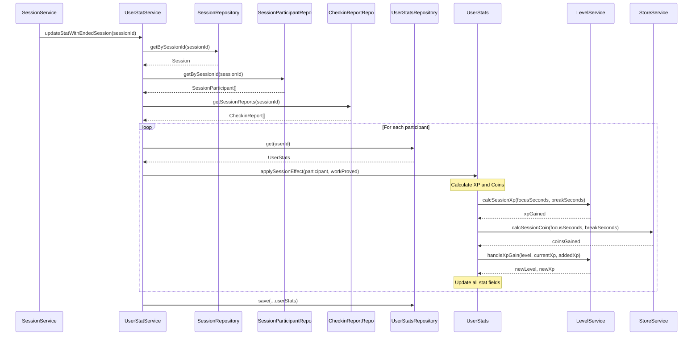
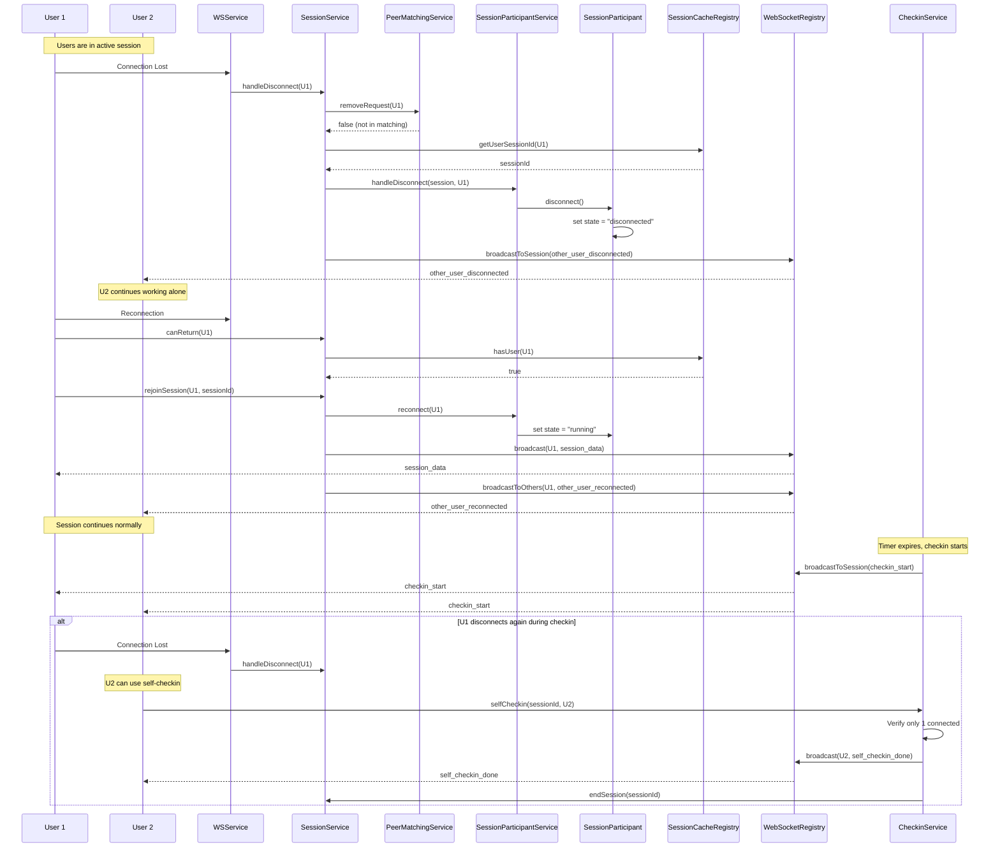

# Tandem System Use Cases

This document identifies 12 use cases from the Tandem system, categorized by complexity, with appropriate diagrams for each level.

---

## Simple Use Cases (CRC Cards)

Simple use cases involve single-class operations with minimal interactions.

### 1. User Registration / Authentication

**Description**: A new user registers or authenticates with the system.

| Class | Responsibilities | Collaborators |
|-------|------------------|---------------|
| **User** | - Store user profile data (id, name, email, image) - Track verification status - Manage timestamps | UserRepository |
| **UserRepository** | - Persist user data - Retrieve user by ID | Database |

---

### 2. View Available Achievements

**Description**: A user views all available achievements in the system.

| Class | Responsibilities | Collaborators |
|-------|------------------|---------------|
| **Achievement** | - Store achievement metadata (id, name, description) | AchievementRepository |
| **AchievementService** | - Retrieve all achievements - Format achievement data | Achievement, AchievementRepository |
| **AchievementRepository** | - Query achievements from database | Database |

---

### 3. Toggle Task Completion

**Description**: A user marks a task as complete or incomplete during a session.

| Class | Responsibilities | Collaborators |
|-------|------------------|---------------|
| **Task** | - Store task data (id, title, isComplete) - Toggle completion status | TaskRepository |
| **TaskRepository** | - Persist task changes - Retrieve tasks by session | Database |

---

### 4. View User Statistics

**Description**: A user views their gamification statistics (XP, level, coins).

| Class | Responsibilities | Collaborators |
|-------|------------------|---------------|
| **UserStats** | - Store user statistics (level, XP, coins, focus time) - Track session counts | UserStatsRepository |
| **UserStatService** | - Retrieve user stat data - Format response | UserStats, UserStatsRepository |
| **UserStatsRepository** | - Query user stats from database | Database |

---

## Moderate Use Cases (Communication Diagrams)

Moderate use cases involve multiple objects with synchronous message passing.

### 5. Request Peer Matching

**Description**: A user requests to be matched with a peer for a focus session.

---

### 6. Initialize Session

**Description**: When two users are matched, the system initializes a focus session.

---

### 7. Handle User Disconnect

**Description**: The system handles when a user disconnects during a session.

---

### 8. Rejoin Session

**Description**: A disconnected user rejoins an active session.

---

## Complex Use Cases (Sequence Diagrams)

Complex use cases involve multiple actors, asynchronous operations, and state transitions.

### 9. Complete Session Lifecycle

**Description**: Full flow from matching request through session completion.

---

### 10. Checkin Workflow with Messages

**Description**: Users exchange messages during checkin phase and submit peer reviews.

---

### 11. Session Statistics Calculation

**Description**: After session ends, the system calculates XP, coins, and updates user stats.

---

### 12. Multi-User Matching with Disconnect Recovery

**Description**: Complex scenario where users are matched, one disconnects, and the session handles graceful recovery.

---

## Summary

| Complexity | Use Case | Diagram Type |
|------------|----------|--------------|
| Simple | User Registration | CRC Card |
| Simple | View Available Achievements | CRC Card |
| Simple | Toggle Task Completion | CRC Card |
| Simple | View User Statistics | CRC Card |
| Moderate | Request Peer Matching | Communication Diagram |
| Moderate | Initialize Session | Communication Diagram |
| Moderate | Handle User Disconnect | Communication Diagram |
| Moderate | Rejoin Session | Communication Diagram |
| Complex | Complete Session Lifecycle | Sequence Diagram |
| Complex | Checkin Workflow with Messages | Sequence Diagram |
| Complex | Session Statistics Calculation | Sequence Diagram |
| Complex | Multi-User Matching with Disconnect Recovery | Sequence Diagram |
